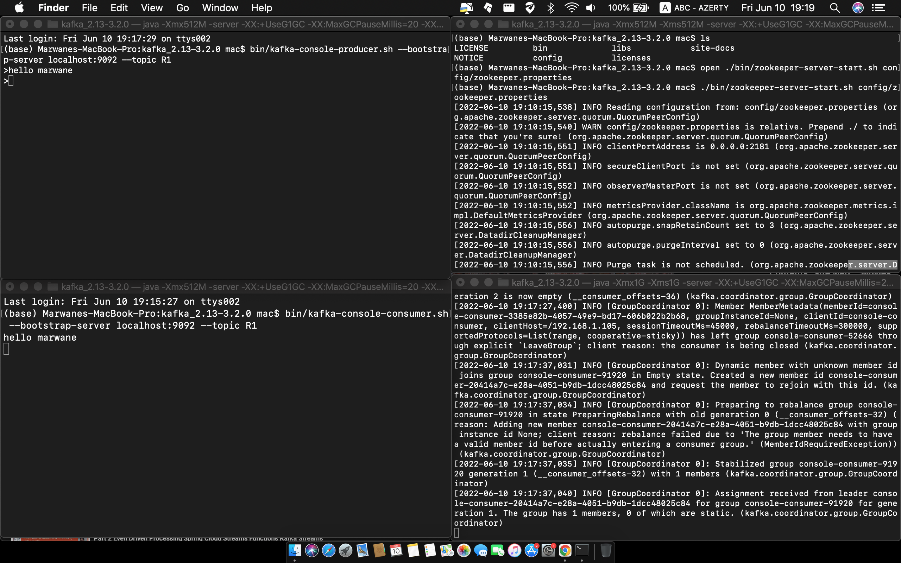
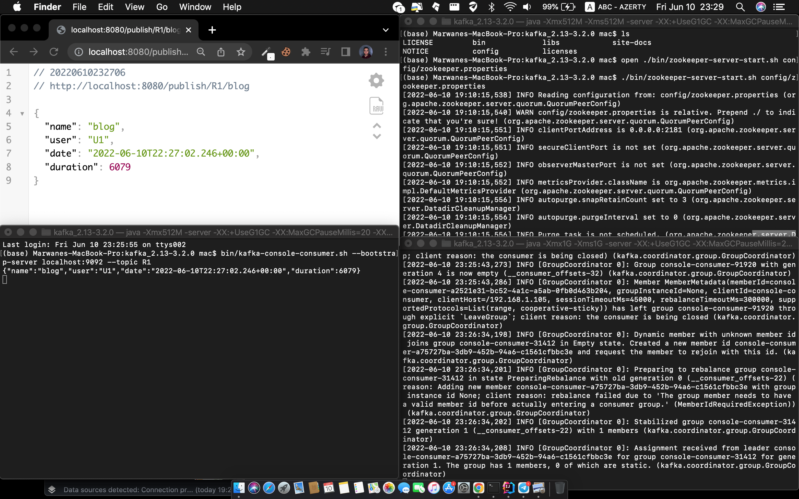
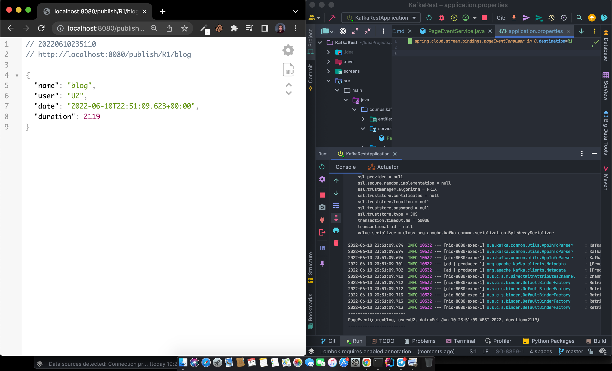
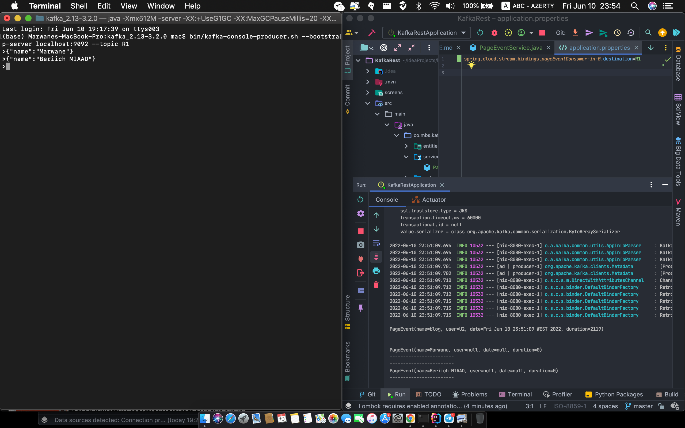
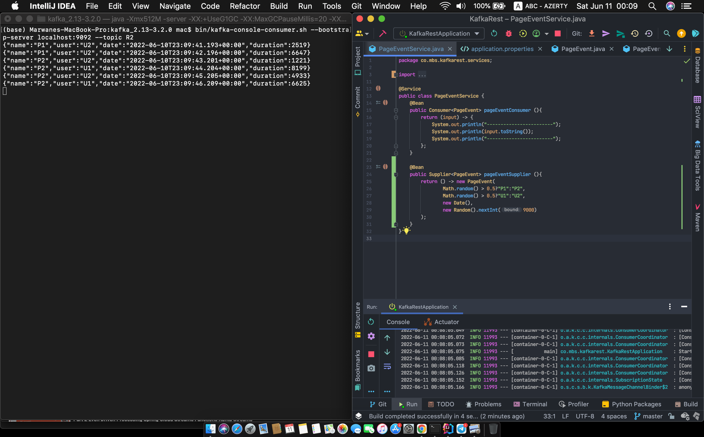
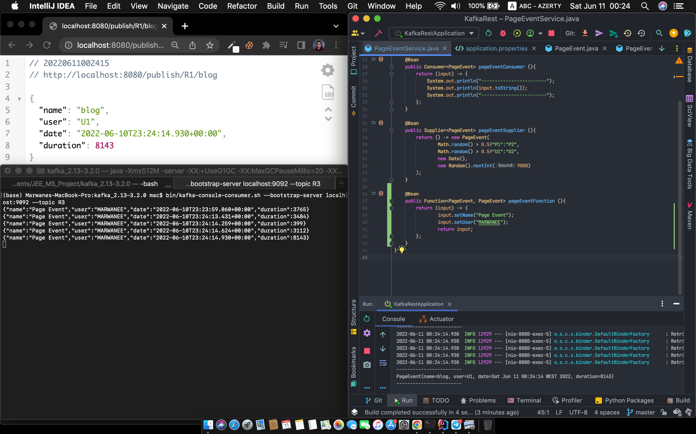
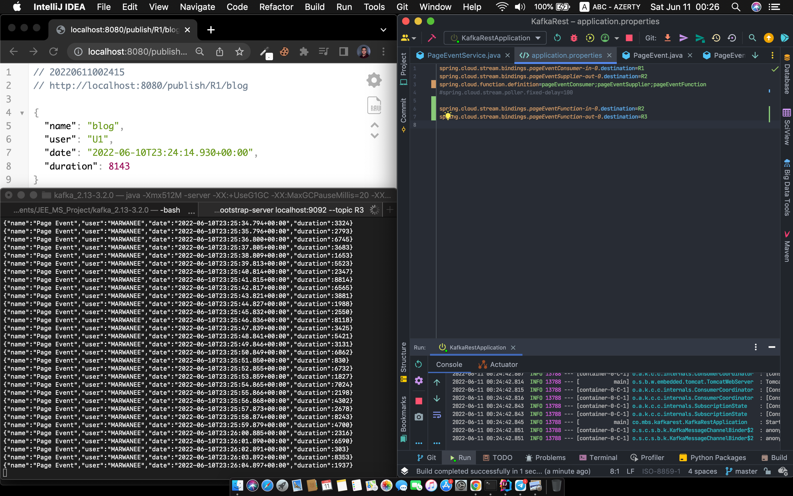

# Kafka Rest Spring application

## Premier partie pour lancer serveur de ZooKeeper et Kafka
Cet étape pour lancer Zookeeper et Kafka avec les deux consoles de Kafkca:
- Kafka Console Producer
- Kafka Console Consumer

### 1er use case

### 2eme use case

Via Browser 

Via Console

### 3eme use case

### 4eme use case

R3 & R1

R3 & R2

